# Visualisation Guide

This comprehensive guide explains all visualisations generated by the quantum solvers.

## Table of Contents
- [Overview](#overview)
- [Infinite Square Well Visualisations](#infinite-square-well-visualisations)
- [Harmonic Oscillator Visualisations](#harmonic-oscillator-visualisations)
- [Time Evolution Visualisations](#time-evolution-visualisations)
- [Understanding the Animations](#understanding-the-animations)
- [Interpreting Results](#interpreting-results)
- [Troubleshooting](#troubleshooting)

---

## Overview

Each solver generates multiple animated GIF files saved in the `gifs/` folder. All animations are designed to illustrate fundamental quantum mechanical concepts through visual dynamics.

### Animation Types

**Energy Level Diagrams:**
- Progressive fade-in of quantum states
- Shows how wavefunctions relate to energy levels
- Combines spatial structure with energy quantisation

**Single Eigenstate Evolution:**
- Time evolution of pure quantum states
- Demonstrates quantum phase dynamics
- Shows why eigenstates are "stationary"

**Superposition Evolution:**
- Quantum interference in action
- Probability density that moves and oscillates
- Demonstrates how motion emerges from superposition

**Wave Packet Dynamics:**
- Real-time propagation and spreading
- Quantum tunneling phenomena
- Classical-quantum correspondence

---

## Infinite Square Well Visualisations

### 1. Energy Level Diagram Animation

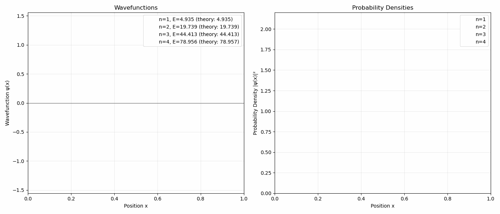

**Description:**
Progressive animation showing quantum states appearing one by one from n=1 to n=4. The left panel shows wavefunctions between the walls, while the right panel shows probability densities.

**What You See:**
- **n=1 (Ground State):** Half sine wave, single hump in probability
- **n=2 (First Excited):** Full sine wave with node at center, two probability peaks
- **n=3 (Second Excited):** 1.5 sine waves with 2 nodes, three probability peaks  
- **n=4 (Third Excited):** 2 sine waves with 3 nodes, four probability peaks

**Key Physics:**
- Energy quantisation: E_n = (n²π²ℏ²)/(2mL²)
- Node theorem: State n has (n-1) internal nodes
- Boundary conditions: ψ(0) = ψ(L) = 0
- Orthogonality of quantum states

**Educational Use:**
- Teaching energy quantisation
- Illustrating wave-particle duality
- Showing eigenstate structure
- Demonstrating node patterns

---

### 2. Ground State Time Evolution

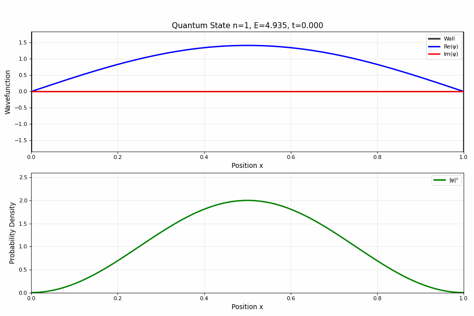

**Description:**
Time evolution of the n=1 ground state showing quantum phase oscillation.

**Top Plot - Wavefunction:**
- **Blue line (Re(ψ)):** Real part oscillates like a sine wave
- **Red line (Im(ψ)):** Imaginary part oscillates 90° out of phase
- **Black lines:** Infinite potential walls at boundaries

**Bottom Plot - Probability Density:**
- **Green line (|ψ|²):** Remains completely static
- Single peak at center of well
- Zero at both walls

**Key Physics:**
- Stationary state: |ψ(x,t)|² = |ψ(x)|²
- Phase evolution: ψ(x,t) = ψ(x)e^(-iE₁t/ℏ)
- Global phase has no observable effect
- Lowest possible energy state

**What to Notice:**
- Real and imaginary parts oscillate smoothly
- Probability density NEVER changes
- No actual particle motion occurs
- Pure quantum phase rotation

---

### 3. Second State Time Evolution

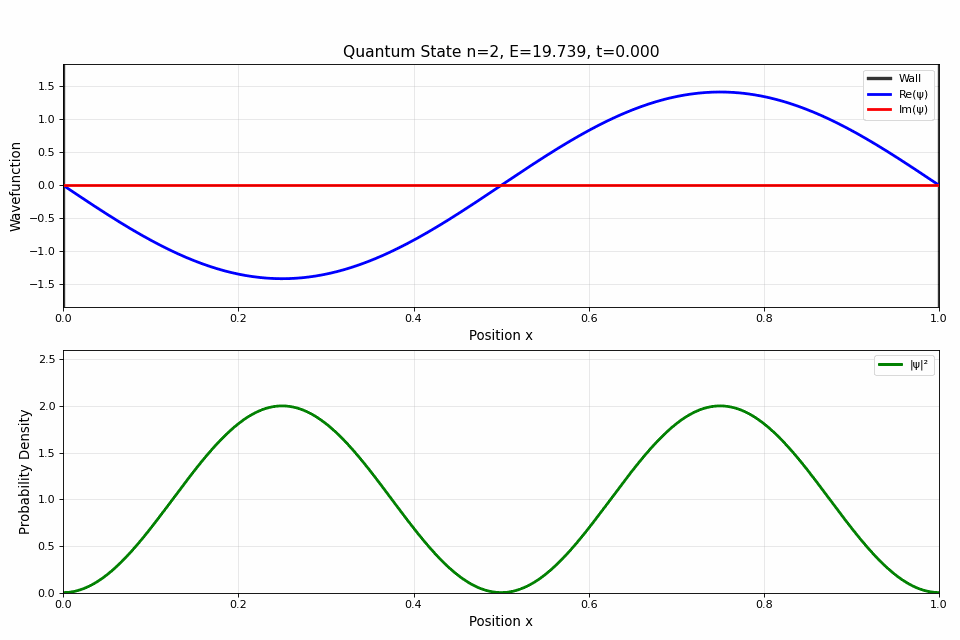

**Description:**
Time evolution of the n=2 first excited state.

**Top Plot:**
- Wavefunction with one node at x=L/2
- Two lobes oscillating with opposite phases
- Node remains fixed at center

**Bottom Plot:**
- Two probability peaks (symmetric)
- Static in time
- Particle more likely near x=L/4 and x=3L/4

**Key Physics:**
- Higher energy: E₂ = 4E₁
- Antisymmetric about center node
- Demonstrates excited state structure
- Still a stationary state

**Comparison with n=1:**
- Faster oscillation (higher frequency ∝ E₂)
- More complex spatial structure
- Same stationary behavior

---

### 4. Superposition Animation

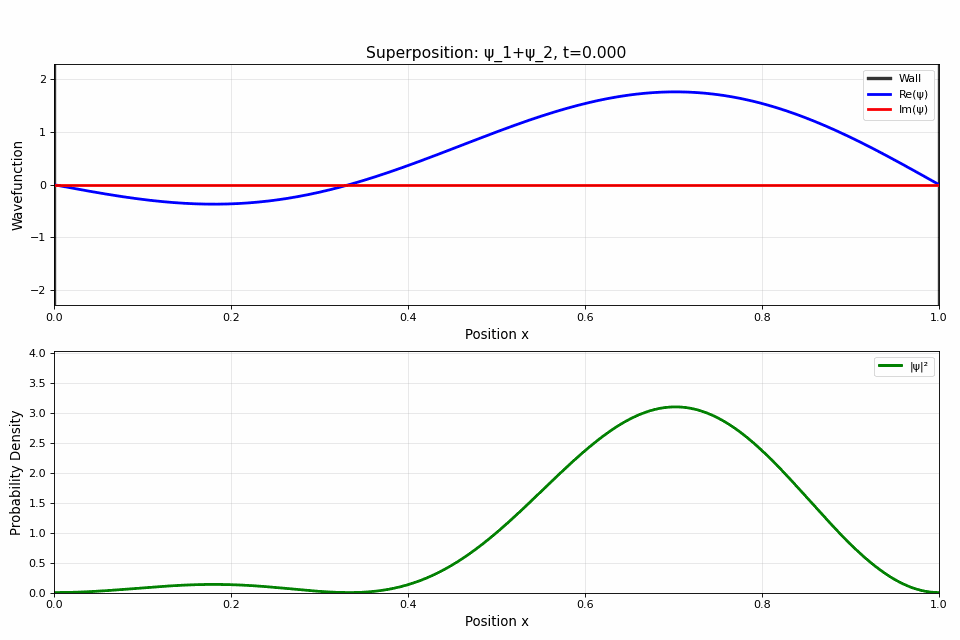

**Description:**
Superposition of n=1 and n=2 states: ψ = (ψ₁ + ψ₂)/√2

**Top Plot:**
- Complex interference patterns
- Wavefunction shape changes over time
- Asymmetric distributions appear

**Bottom Plot:**
- **Probability density oscillates!**
- Wave packet "sloshes" between walls
- Moves left-right-left-right
- Period: T = 2πℏ/(E₂ - E₁)

**Key Physics:**
- Quantum beats at frequency ω = (E₂ - E₁)/ℏ
- Interference creates dynamics
- Non-stationary state
- Demonstrates quantum superposition principle

**What Makes This Special:**
- THIS IS WHERE MOTION APPEARS!
- Probability density moves (unlike eigenstates)
- Shows quantum-classical correspondence
- Demonstrates that motion comes from superposition

---

## Harmonic Oscillator Visualisations

### 1. Energy Level Diagram Animation

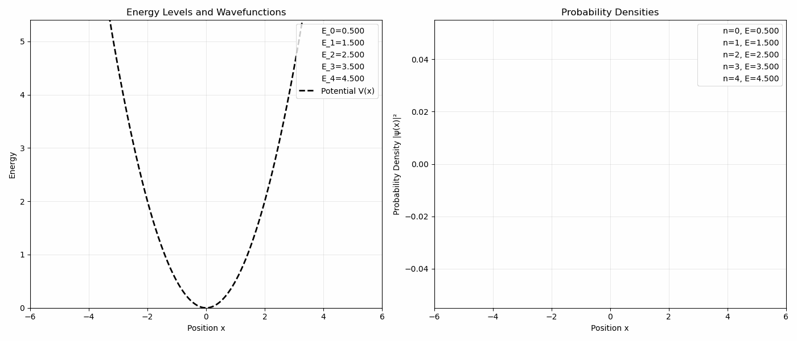

**Description:**
Progressive animation of quantum states in parabolic potential V(x) = ½mω²x².

**What You See:**
- **Black dashed curve:** Parabolic potential well
- **Horizontal lines:** Energy levels at E_n = ℏω(n + ½)
- **Colored curves:** Wavefunctions drawn at their energy heights
- **Right panel:** Probability densities

**Energy Levels:**
- n=0: E₀ = 0.5ℏω (zero-point energy)
- n=1: E₁ = 1.5ℏω
- n=2: E₂ = 2.5ℏω
- n=3: E₃ = 3.5ℏω
- n=4: E₄ = 4.5ℏω

**Key Physics:**
- Equal energy spacing: ΔE = ℏω (unique property!)
- Zero-point energy: Ground state has E > 0
- Gaussian-like ground state
- Hermite polynomial eigenfunctions

**Symmetry Patterns:**
- Even n (0,2,4): Symmetric wavefunctions, even parity
- Odd n (1,3,5): Antisymmetric wavefunctions, odd parity

---

### 2. Ground State Time Evolution

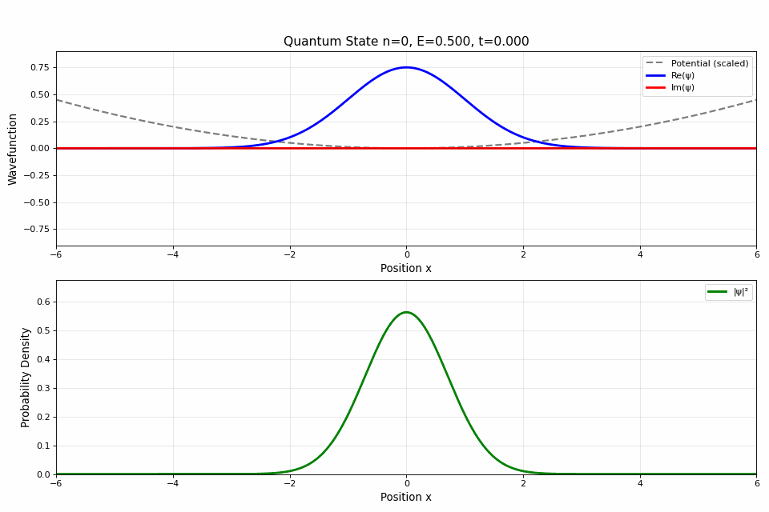

**Description:**
Time evolution of n=0 ground state (Gaussian wavefunction).

**Top Plot:**
- Single hump centered at x=0
- Real and imaginary parts oscillate
- Parabolic potential shown

**Bottom Plot:**
- Gaussian probability distribution
- **Remains static** (stationary state)
- Maximum at equilibrium position

**Key Physics:**
- Lowest energy state: E₀ = ½ℏω
- Zero-point motion (cannot be at rest)
- Minimum uncertainty state: Δx·Δp = ℏ/2
- No nodes in wavefunction

**Classical Analogy:**
- Like a vibrating spring at its lowest energy
- But particle never stops moving (quantum)
- Probability spread cannot be reduced further

---

### 3. First Excited State Time Evolution

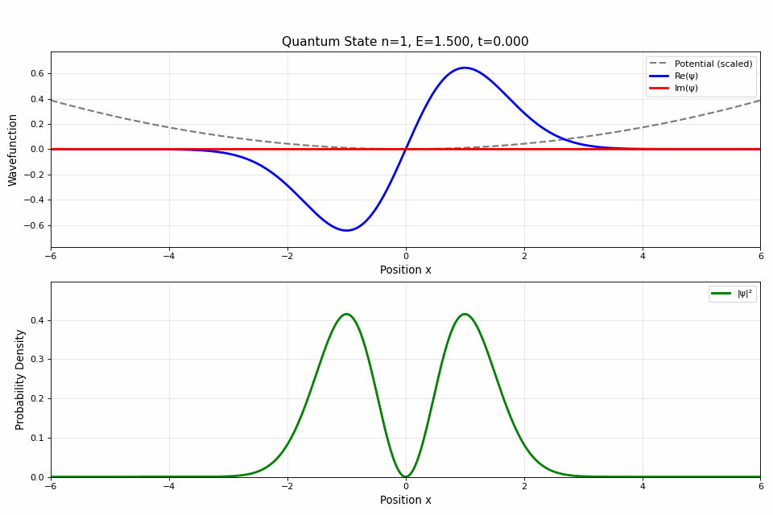

**Description:**
Time evolution of n=1 first excited state.

**Top Plot:**
- Two lobes with node at x=0
- Antisymmetric wavefunction
- Oscillates with phase

**Bottom Plot:**
- Two probability peaks (symmetric)
- Zero probability at center
- Static distribution

**Key Physics:**
- Energy: E₁ = 3/2 ℏω
- Odd parity: ψ(-x) = -ψ(x)
- One node (n-1 rule holds)
- Stationary state

**Comparison with n=0:**
- Higher energy → faster phase oscillation
- Node structure (0 vs 1 node)
- Both have static |ψ|²

---

### 4. Superposition Animation

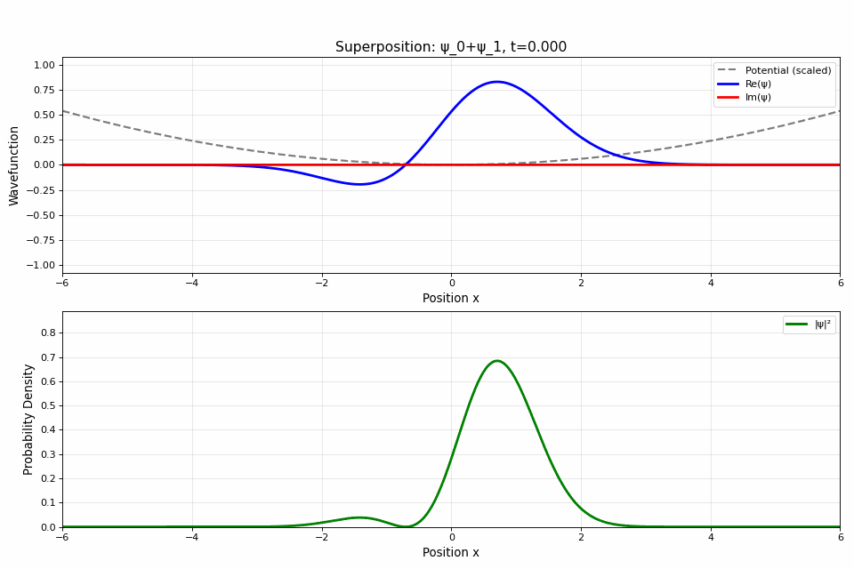

**Description:**
Superposition of n=0 and n=1: ψ = (ψ₀ + ψ₁)/√2

**Top Plot:**
- Wavefunction shifts position
- Alternates between symmetric and asymmetric
- Complex interference patterns

**Bottom Plot:**
- **Probability density oscillates!**
- Wave packet moves back and forth
- "Breathing" motion (expands and contracts)
- Period: T = 2π/ω (matches classical period!)

**Key Physics:**
- Coherent state oscillation
- Quantum beats at ω = ΔE/ℏ = ω
- Demonstrates quantum harmonic motion
- Classical-quantum correspondence

**Special Property:**
- Oscillation period = classical period
- Shows how quantum → classical for oscillators
- Wave packet moves like classical particle
- But maintains quantum superposition

---

## Time Evolution Visualisations

### 1. Free Particle Evolution

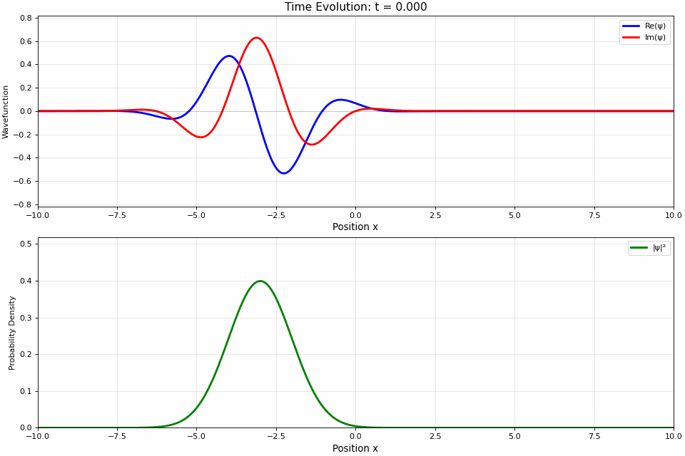

**Description:**
Gaussian wave packet in free space (no potential).

**Top Plot:**
- Wave packet moves to the right
- Packet spreads out over time
- No potential (flat line)

**Bottom Plot:**
- Probability density moves with velocity v = ℏk/m
- Width increases (uncertainty principle)
- Peak height decreases (conservation of probability)

**Key Physics:**
- Wave packet spreading: Δx(t) = Δx(0)√[1 + (ℏt/2mΔx²)²]
- Group velocity: v_g = ℏk₀/m
- Dispersion relation: ω = ℏk²/2m
- Uncertainty principle: Δx·Δp ≥ ℏ/2

**What to Notice:**
- Packet moves with constant velocity (initially)
- Spreading is inevitable (quantum mechanics)
- Momentum uncertainty causes spreading
- No forces acting on particle

---

### 2. Harmonic Oscillator (Wave Packet)

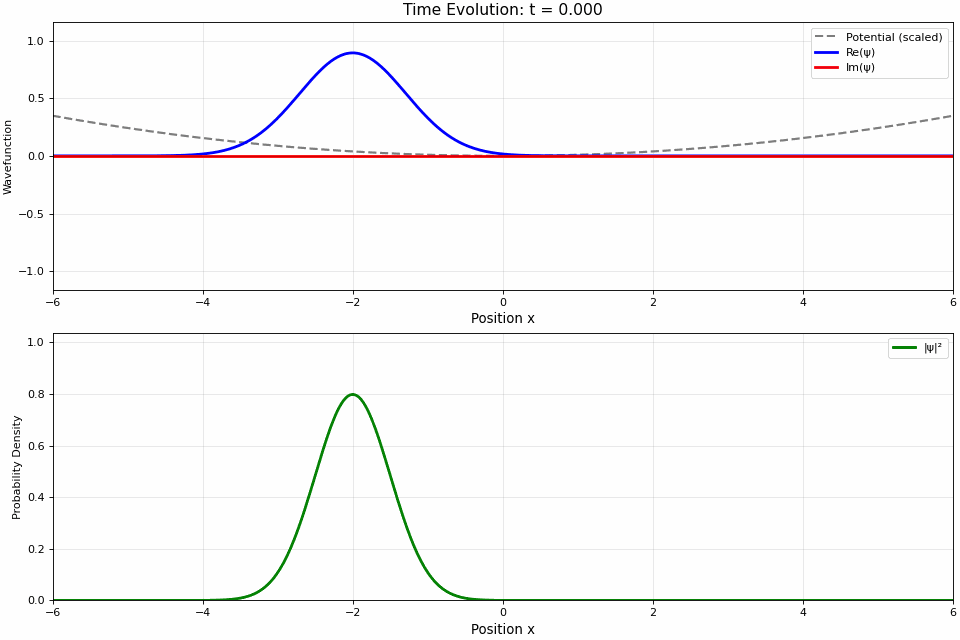

**Description:**
Gaussian wave packet oscillating in harmonic potential.

**Top Plot:**
- Parabolic potential curve
- Wave packet bounces back and forth
- Breathing motion (width oscillates)

**Bottom Plot:**
- Probability density oscillates
- Period matches classical: T = 2π/ω
- Packet width varies periodically

**Key Physics:**
- Coherent state evolution
- Classical-quantum correspondence
- Revival phenomena
- Quasi-classical behavior

**Classical Connection:**
- Behaves like classical particle
- Period identical to classical oscillator
- But maintains quantum width
- Demonstrates correspondence principle

---

### 3. Quantum Tunneling

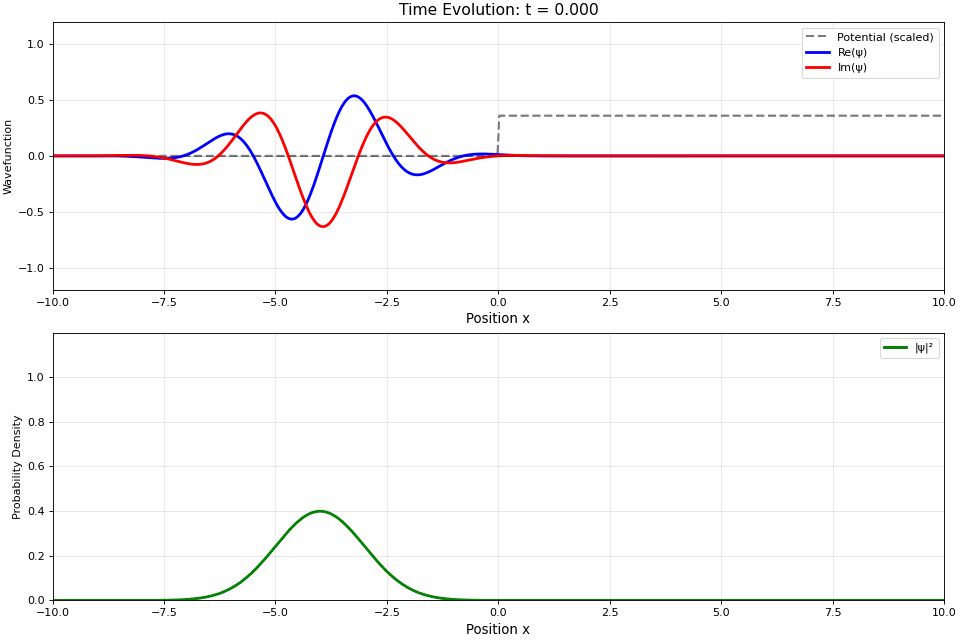

**Description:**
Wave packet encountering potential step barrier at x=0.

**Top Plot:**
- Step potential (flat, then elevated)
- Packet approaches from left
- Splits into reflected and transmitted parts

**Bottom Plot:**
- **Partial reflection:** Some probability bounces back
- **Partial transmission:** Some probability penetrates barrier
- Even when E < V (classically forbidden!)

**Key Physics:**
- Tunneling probability: T ∝ exp(-2κL) where κ = √[2m(V-E)]/ℏ
- Reflection coefficient + Transmission coefficient = 1
- Purely quantum phenomenon
- No classical analog

**Three Phases:**
1. **Approach:** Packet moves toward barrier
2. **Interaction:** Packet encounters barrier
3. **Aftermath:** Split into reflected and transmitted parts

**Observable Effects:**
- Reflected packet moves backward
- Transmitted packet has reduced amplitude
- Some probability penetrates classically forbidden region
- Total probability conserved

---

## Understanding the Animations

### Animation Components

**Top Plot (Wavefunction):**
- **Blue line:** Re(ψ) - Real part of wavefunction
- **Red line:** Im(ψ) - Imaginary part of wavefunction  
- **Black dashed line:** Potential V(x) (if present)
- **Title:** Shows quantum state and time

**Bottom Plot (Probability):**
- **Green line:** |ψ|² - Probability density
- **Area under curve = 1** (normalization)
- Shows where particle is likely to be found

### Reading the Title

**Single Eigenstates:**
```
Quantum State n=1, E=4.935, t=2.145
```
- n: quantum number
- E: energy eigenvalue
- t: current time

**Superpositions:**
```
Superposition: ψ_1+ψ_2, t=2.145
```
- Lists which states are combined
- Shows current time

---

## Interpreting Results

### Stationary vs Non-Stationary States

**Stationary States (Single Eigenstates):**
- ✅ Probability density |ψ|² is constant in time
- ✅ Only phase changes: ψ(t) = ψ(0)e^(-iEt/ℏ)
- ✅ No observable motion
- ✅ Definite energy

**Non-Stationary States (Superpositions):**
- ✅ Probability density |ψ|² changes with time
- ✅ Observable motion and dynamics
- ✅ Quantum interference effects visible
- ✅ No definite energy (spread of energies)

### What "Static Probability" Means

For single eigenstates, the probability density doesn't move because:

```
|ψ(x,t)|² = |ψ(x)·e^(-iEt/ℏ)|²
          = |ψ(x)|² · |e^(-iEt/ℏ)|²
          = |ψ(x)|² · 1
          = |ψ(x)|²  ← Time independent!
```

The phase factor has unit magnitude, so it cancels in the probability!

### Why Superpositions Show Motion

For superposition ψ = c₁ψ₁ + c₂ψ₂:

```
|ψ|² = |c₁ψ₁|² + |c₂ψ₂|² + 2Re[c₁c₂*ψ₁*ψ₂e^(i(E₁-E₂)t/ℏ)]
                              ↑
                    Interference term oscillates!
```

This interference term creates time-dependent dynamics.

---

## Troubleshooting

### Common Issues

**Problem: Animation shows flat line**
- **Cause:** Y-axis scale is wrong
- **Solution:** Check that `solve()` was called before animating
- **Fix:** Verify wavefunction normalization

**Problem: Probability density > 1**
- **Cause:** Normalization error
- **Solution:** Increase grid resolution (larger N)
- **Check:** `np.trapz(|ψ|², x)` should equal 1.0

**Problem: Non-zero at walls (infinite well)**
- **Cause:** Boundary conditions not enforced
- **Solution:** Check T[0,0] and T[-1,-1] are set to large values
- **Verify:** ψ(0) and ψ(L) should be exactly zero

**Problem: Superposition looks static**
- **Cause:** States have same energy (degenerate)
- **Solution:** Use states with different n values
- **Check:** E₁ ≠ E₂ for quantum beats to occur

**Problem: GIF file too large (>50 MB)**
- **Cause:** Too many frames or high dpi
- **Solution:** Reduce `n_frames` or `dpi` parameter
- **Optimize:** Use `n_frames=100, dpi=80`

**Problem: Animation is choppy**
- **Cause:** Not enough frames
- **Solution:** Increase `n_frames` parameter
- **Recommend:** Use `n_frames=150` or higher

---

## Advanced Observations

### Quantum Nodes

**Pattern Recognition:**
- State n has (n-1) internal nodes
- Nodes are points where ψ(x) = 0
- Higher energy → more nodes → more oscillation

**Physical Meaning:**
- More nodes = higher curvature = higher kinetic energy
- Nodes represent destructive quantum interference

### Classical Turning Points

For harmonic oscillator, classical turning points where E = V(x):

```
x_classical = ±√(2E/mω²)
```

**Observation:**
- Quantum wavefunction extends beyond these points
- Exponential decay in classically forbidden region
- Tunneling probability ∝ exp(-∫κdx)

### Quantum-Classical Correspondence

**When Quantum Looks Classical:**
1. Large quantum numbers (n >> 1)
2. Superposition of many states
3. Coherent states in harmonic oscillator
4. Wave packets in free space

**Correspondence Principle:**
As n → ∞, quantum mechanics → classical mechanics

---

## Tips for Educational Use

### In Presentations

**Energy Diagrams:**
- Use to introduce quantum quantisation
- Show progressive build-up of states
- Pause at each state to discuss

**Single Eigenstates:**
- Emphasize stationary nature
- Contrast real and imaginary parts
- Explain phase vs. probability

**Superpositions:**
- Highlight moving probability
- Compare with eigenstates
- Demonstrate interference

**Tunneling:**
- Show before and after barrier
- Discuss classical impossibility
- Connect to real applications (STM, α-decay)

### For Students

**Key Questions to Ask:**
1. Why doesn't |ψ|² change for eigenstates?
2. Where does motion come from in superpositions?
3. How many nodes does state n have?
4. What is zero-point energy and why does it exist?
5. How does quantum tunneling violate classical physics?

**Exercises:**
- Predict |ψ|² from ψ(x)
- Calculate beat frequency from energies
- Identify quantum numbers from node count
- Estimate tunneling probability

---

## File Specifications

### Technical Details

| Parameter | Value |
|-----------|-------|
| Format | GIF (Graphics Interchange Format) |
| Frame Rate | 20 fps |
| Resolution | 80-100 dpi |
| Duration | 5-10 seconds |
| File Size | 1-5 MB per animation |
| Color Depth | 256 colors per frame |

### Viewing Requirements

**Compatible With:**
- All modern web browsers
- Image viewers (Photos, Preview, etc.)
- Presentation software (PowerPoint, Google Slides)
- Markdown documents
- LaTeX documents (with graphicx package)

**Playback:**
- Loops automatically
- No additional software required
- Works offline
- Cross-platform compatible

---

[← Back to README](../README.md) | [Theory Guide →](Theory.md) | [Customisation Guide →](Customisation.md)